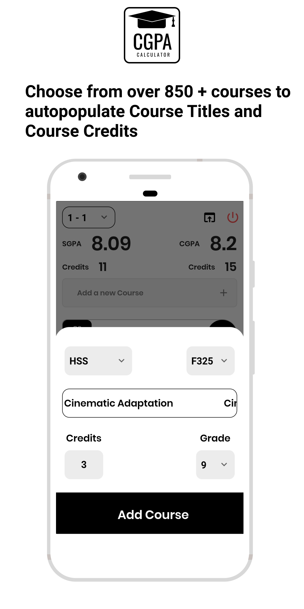
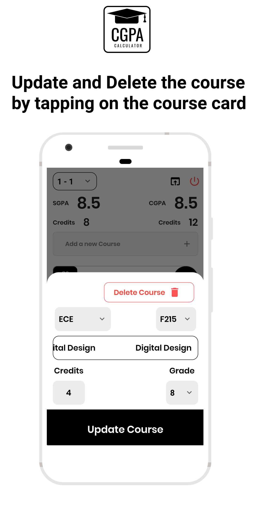
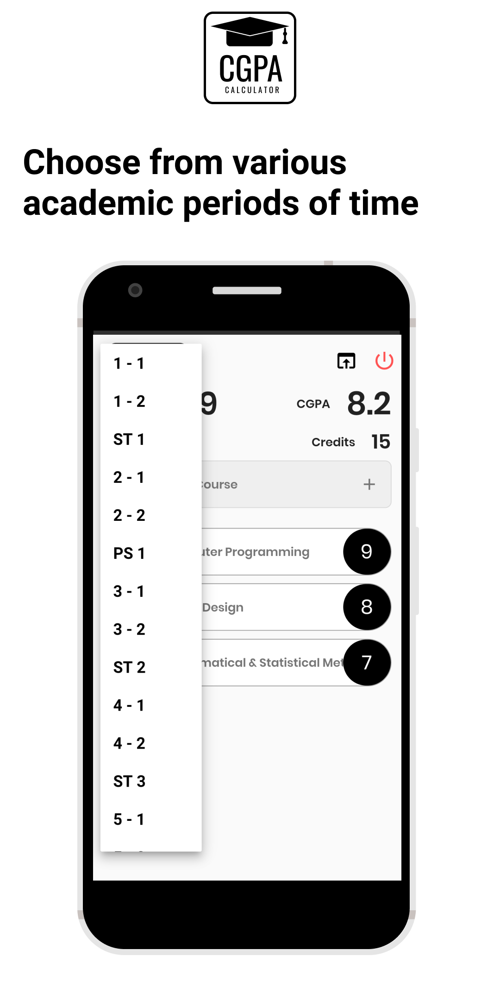
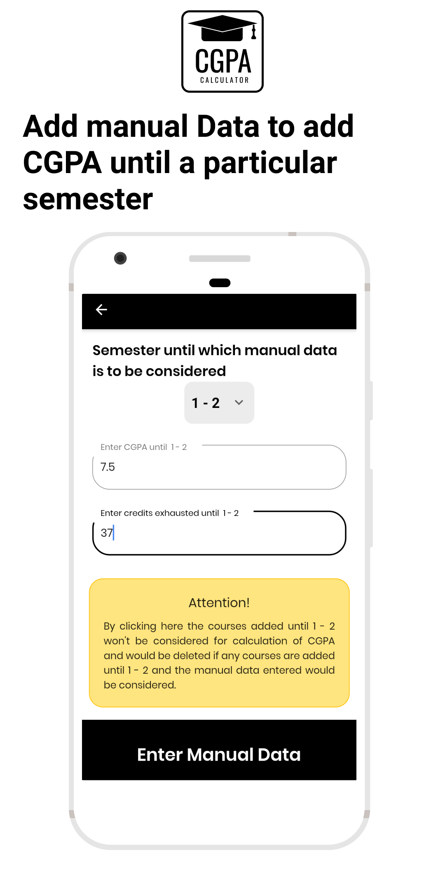
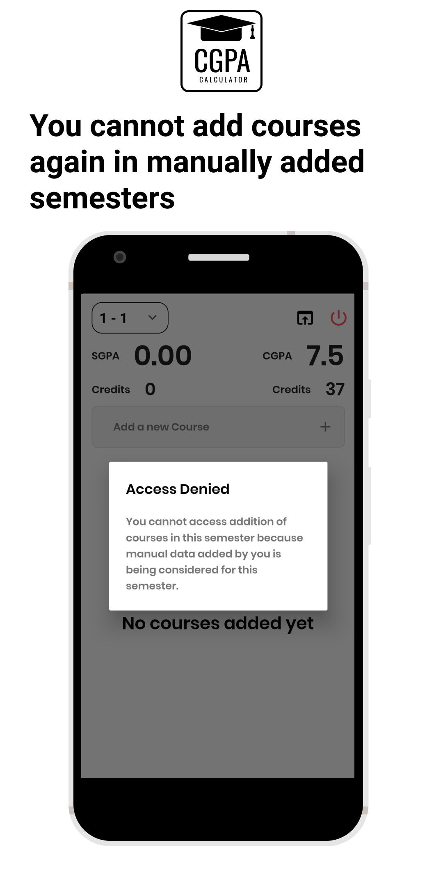

## CGPA Calculator

#### Introduction

CGPA Calculator is mainly aimed at enabling BITS’ians to calculate and journalise their grades achieved in different semesters with the feature of calculating their SGPA and CGPA.
<br/>
The calculation is automatic and without any hassle. Just add the course you are pursuing in a semester, the course title is automatically detected. Add credits of that course and your grade achieved to add that course for SGPA and CGPA calculation. You can plug and play with the courses anytime you want.
<br/>
CGPA Calculator App is developed using Flutter. Authentication is performed using Firebase and the data of the user is stored inside the phone storage itself using persistent data storage SQFlite package called Moor.

<br/>
##### This app is published at https://play.google.com/store/apps/details?id=com.saiankit.cgpacalculator

------

#### Salient Features of CGPA Calculator

###### Video Version : https://youtu.be/fHrFlq0kOGY

###### Photographic Version :


|  |  |  |  |
| ----------------------------------------------------- | ----------------------------------------------------- | ----------------------------------------------------- | ----------------------------------------------------- |
|  |  |  |  |

------


#### Navigation Schematic


#### How to use the app locally on your machine ?

<u>Requirements</u>

1. Flutter installed on your machine.
2. A simulator/emulator for running the application.

**Step #1** : Clone this repository using

``` git clone https://github.com/saiankit/CgpaCalculator.git ```

**Step #2** : Run the following command in the directory

``` flutter packages get```

**Step #3**: Open a simulator / emulator and run the application

``` flutter run```

- - - -

#### How to submit a new course for the database
Thanks for showing interest in improving the database of CGPA Calculator
To submit a new course that has to be included in the database
Go to the issues tab and select the issue template - Create a new Course, and fill in the details accordingly

### Created and Maintained by
#### Sai Ankit ( [Code Studio Sai Ankit](https://www.youtube.com/c/CodeStudioSaiAnkit?sub_confirmation=1) )